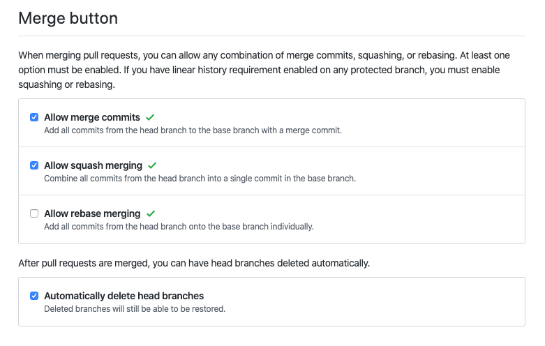

# repoconfig

A CLI to execute a bulk update for GitHub repository configs.

Some configs that `repoconfig` can set are below.



## Prerequisites

Create a GitHub token and set it via the environment variable `GITHUB_TOKEN`.

## Installation

```console
$ go get github.com/micnncim/repoconfig/cmd/repoconfig
```

## Usage

If you feel worried about how `repoconfig` works, setting `--dry-run` at first is recommended.
With `--dry-run`, `repoconfig` doesn't update repository configs at all.

The form of arguments is `OWNER` or `OWNER/REPO`.
Multiple arguments are acceptable.

**Caution**: If `OWNER` is specified, rather than `OWNER/REPO`, `repoconfig` will update **all** the repositories of the `OWNER`.

The following help describes the flags.

```console
$ repoconfig --help
CLI to update repository configs

Usage:
  repoconfig [flags]

Flags:
      --allow-merge-commit       Whether to allow merging pull requests with a merge commit (default true)
      --allow-rebase-merge       Whether to allow rebase-merging pull requests (default true)
      --allow-squash-merge       Whether to allow allow squash-merging pull requests (default true)
      --default-branch string    The default branch for a repository (default "master")
      --delete-branch-on-merge   Whether to allow automatically deleting head branches when pull requests are merged
      --dry-run                  Whether user dry-run mode
      --has-issues               Whether a repository has issues (default true)
      --has-projects             Whether a repository has projects (default true)
      --has-wiki                 Whether a repository has wiki (default true)
      -h, --help                 help for repoconfig
```

## Example

```console
$ repoconfig micnncim micnncim/github-lab micnncim/github-actions-lab --delete-branch-on-merge=true
2020-04-30T02:58:31.558+0900    INFO    app.github      successfully updated repository {"owner": "micnncim", "repo": "github-lab", "update_repository_options": {"has_issues":true,"has_projects":true,"has_wiki":true,"default_branch":"master","allow_squash_merge":true,"allow_merge_commit":true,"allow_rebase_merge":true,"delete_branch_on_merge":true}, "dry_run": false}
2020-04-30T02:58:32.138+0900    INFO    app.github      successfully updated repository {"owner": "micnncim", "repo": "github-actions-lab", "update_repository_options": {"has_issues":true,"has_projects":true,"has_wiki":true,"default_branch":"master","allow_squash_merge":true,"allow_merge_commit":true,"allow_rebase_merge":true,"delete_branch_on_merge":true}, "dry_run": false}
```

```console
$ repoconfig monalisa --delete-branch-on-merge=true
2020-04-30T02:58:31.558+0900    INFO    app.github      successfully updated repository {"owner": "monalisa", "repo": "monalisa-repo1", "update_repository_options": {"has_issues":true,"has_projects":true,"has_wiki":true,"default_branch":"master","allow_squash_merge":true,"allow_merge_commit":true,"allow_rebase_merge":true,"delete_branch_on_merge":true}, "dry_run": false}
2020-04-30T02:58:32.138+0900    INFO    app.github      successfully updated repository {"owner": "monalisa", "repo": "monalisa-repo2", "update_repository_options": {"has_issues":true,"has_projects":true,"has_wiki":true,"default_branch":"master","allow_squash_merge":true,"allow_merge_commit":true,"allow_rebase_merge":true,"delete_branch_on_merge":true}, "dry_run": false}
```

## References

- [Repositories | GitHub Developer Guide](https://developer.github.com/v3/repos/#update-a-repository)
